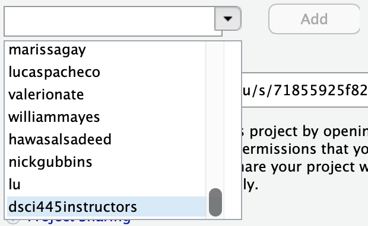

# hw-4

Homework 4 in DSCI445: Statistical Machine Learning @ CSU

## Assignment

**Note:** `tidymodels` does not include a way to perform subset selection. Here is a useful list of functions for the methods in this chapter:

- `regsubsets` in the `leaps` package performs subset selection methods.
- `linear_reg(mixture = 0, penalty = lambda) |> set_mode("regression") |> set_engine("glmnet")` defines ridge regression with penalty $\lambda$.
- `linear_reg(mixture = 1, penalty = lambda) |> set_mode("regression") |> set_engine("glmnet")` defines the lasso with penalty $\lambda$.
- Recipe steps `step_dummy(all_nominal_predictors())`, `step_normalize(all_predictors())`, and `step_pca(all_predictors(), threshold = tune())` create PCA components.
- Recipe steps `step_dummy(all_nominal_predictors())`, `step_normalize(all_predictors())`, and `step_pls(all_predictors(), threshold = tune())` create PLS components.

Be sure to `set.seed(445)`.

1. In this exercise, we will generate simulated data, and then use this data to perform best subset selection.

    a) Use `rnorm` to generate a predictor $X$ of length $n = 100$ and a noise vector $\epsilon$ also f length $n = 100$.
    
    b) Generate a response vector $Y$ of length $n = 100$ according to the model
        $$
        Y = \beta_0 + \beta_1 X + \beta_2 X^2 + \beta_3 X^3 + \epsilon
        $$
        where $\beta_0 = 1, \beta_1 = -0.5, \beta_2 = 2, \beta_3 = -1$.
    
    c) Use the `regsubsets` function in the `leap` package to perform best subset selection in order to choose the best model containing the predictors $X, X^2, \dots, X^{10}$. What is the best model obtained according to $C_p$, BIC, and Adjusted $R^2$? Shoe some plots to provide evidence for your answer and report the coefficients of the best model obtained. 
    
        [**Hint 1:** The `poly` function may be useful for creating the model formula.]
        
        [**Hint 2:** You will need to make a data frame with your X and Y variables.]
        
    d) Repeat c. using forward stepwise selection and also using backwards stepwise selection. How does your answer compare to the results in c.?
    
    e) Now fit a lasso model to the simulated data using $X, X^2, \dots, X^{10}$ as predictors. Use $10$-fold CV to choose the optimal value of $\lambda$. Create plots of the CV error as a function of \lambda. Report the resulting coefficient estimates and discuss the results obtained.
    
2. In this exercise we will predict the number of applications received using the other variables in the `College` data set (in the `ISLR` package).

    a) Split the data into training (60%) and "test" (40%) set randomly.
    
    b) Fit a linear model using least squares on the training set and report the test set error obtained.
    
    c) Fit a ridge regression model on the training set with $\lambda$ chosen using 10-fold CV (on the training set only). Report the test error obtained.
    
    d) Fit the lasso on the training set with $\lambda$ chosen using 10-fold CV (on the training set only). Report the test error obtained, along with the number of non-zero coefficient estimates.
    
    e) Fit a PCR model on the training set with $M$ chosen using 10-fold CV (on the training set only). Report the test error obtained, along with the value of $M$ selected by CV.
    
    f) Fit a PLS model on the training set with $M$ chosen using 10-fold CV (on the training set only). Report the test error obtained, along with the value of $M$ selected by CV.
    
    g) Comment on the results obtained. How acurately can we predict the number of college applications received? Is there much difference among the test errors resulting from these five approaches?
    
3. We have seen that as the number of features used in a model increases, the training error will necessarily decrease, but the test error may not. We will explore this with a simulated data set. Run the following code to generate your dataset.

    
    ```r
    p <- 20
    n <- 1000
    
    X <- matrix(rnorm(n * p), nrow = n, ncol = p) ## predictors
    beta <- matrix(c(rnorm(8), rep(0, p - 8)), ncol = 1) ## 12 elements are equal to zero
    
    y <- X %*% beta + rnorm(n, 0, .5) ## y = Xbeta + epsilon
    ```

    a. Split your data into a training set containing 100 observations and a test set containting 900 observations.
    
    b. Perform best subset selection on the training set and plot the training set MSE associated with the best model of each size (**Hint** How do we calculate MSE?).
    
    c. Plot the test set MSE associated with the best model of each size. Hint, to get the predicted values, use matrix multiplication (`%*%`) to multiply the test data by the fitted coefficients of each model: $X\hat{\beta}$. Note there is no `predict` function for `regsubsets` objects.
    
    d. For which model size does the test set MSE take its minimum value? Comment on your results.
    
    e. How does the model at which the test set MSE is minimized compare to the true model used to generate the data? Comment on the coefficient values.
    
4. We will now try to predict per capita crime rate in the `Boston` data set from the `ISLR` package.

    a. Try out some of the regression methods explored in this chapter such as best subset, the lasso, ridge regression, and PCR. Present and discuss results for the approaches that you consider.
    
    b. Propose a model or a set of models that seem to perform well on this data set and justify your answer. Make sure that you are evaluating performance using validation error, cross-validation error, or some other reasonable alternative (not just training error).
    
    c. Does your chosen model involve all of the features in the data set? Why or why not?

Turn in in a pdf of your analysis to canvas using the provided Rmd file as a template. Your Rmd file on the server will also be used in grading, so be sure they are identical.

**Be sure to share your server project with the instructor and grader:**

1. Open your hw-4 project on liberator.stat.colostate.edu
2. Click the drop down on the project (top right side) > Share Project...
    
    
  
3. Click the drop down and add "dsci445instructors" to your project.

    

This is how you **receive points** for reproducibility on your homework!   
